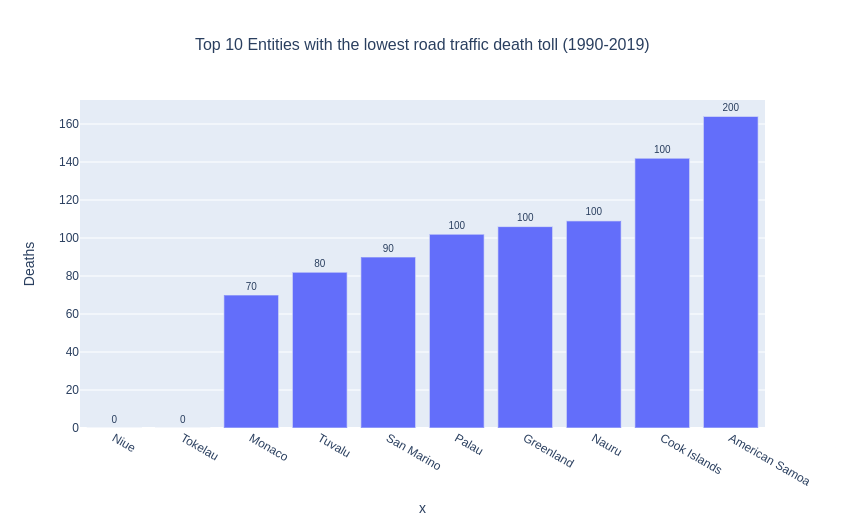
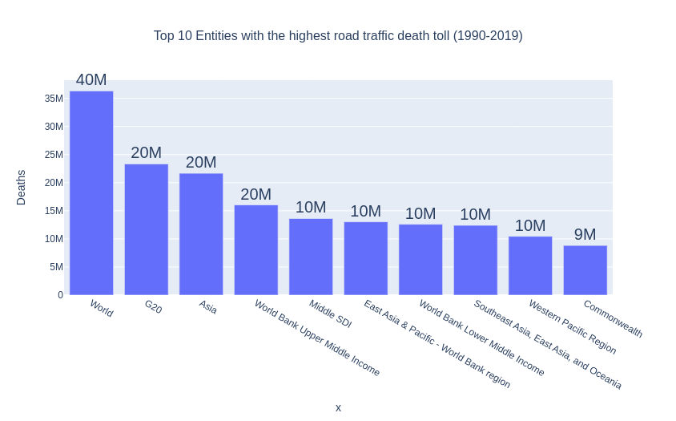

# Road traffic deaths, 1990 to 2019 EDA Using Pandas

## Pandas
Pandas is a software library written for the Python programming language for data manipulation and analysis. In particular, it offers data structures and operations for manipulating numerical tables and time series. It is free software released under the three-clause BSD license.

## Objectives
* Top 10 entities to have minimum no of deaths or safest to drive?
* Top 10 entities to have maximum no of deaths or dangerous to drive?

## Dataset
[Road traffic deaths, 1990 to 2019](https://www.kaggle.com/datasets/shivkumarganesh/road-traffic-deaths-1990-to-2019/code)

## EDA Structure
 - Load dataset from csv.
 - Bird eye view on the dataset,
 - Cleaning the dataset removing or handling null values.
 - Answering questions by making graphs.
 
 ### Graph
 
 
 ### Graph
 
